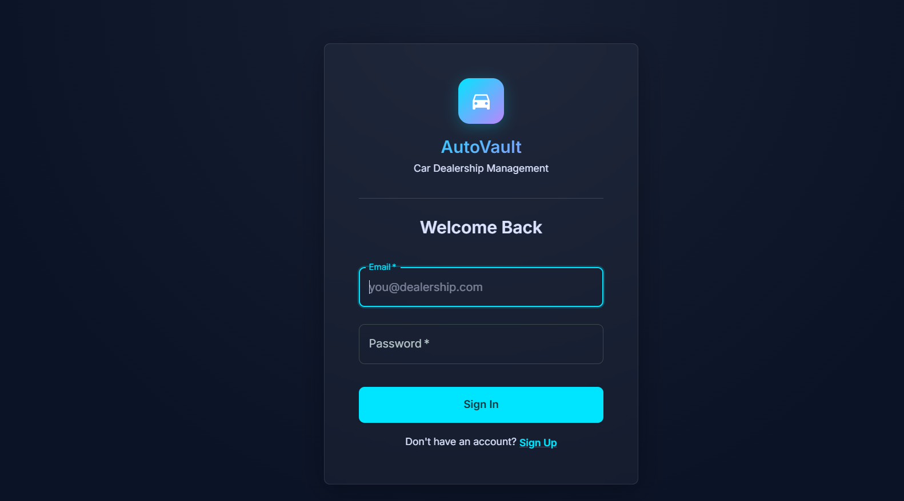
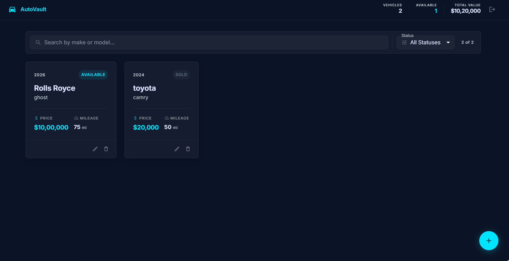

# AutoVault: Car Dealership Inventory System

AutoVault is a full-stack TypeScript application for managing a dealership inventory. It combines a secure Express and Prisma backend with a polished React + Vite frontend so users can register, sign in, and manage vehicle listings from one dashboard.

## Project Overview

This project was built as a modern full-stack demo for a car dealership workflow. The backend exposes authenticated APIs for user accounts and vehicle inventory, while the frontend provides a responsive experience for browsing, searching, and editing cars in the catalog.

## What the app includes

- Secure user registration and login with JWT-based authentication
- Protected routes for creating, editing, and deleting vehicle listings
- Inventory cards with search and status filtering
- A modern Material UI experience for desktop and mobile viewing
- Prisma + SQLite for a lightweight local database setup

## Tech stack

- Frontend: React, Vite, TypeScript, Material UI
- Backend: Node.js, Express, TypeScript
- Database: Prisma ORM with SQLite
- Testing: Jest for the API and Vitest for the frontend

## Project structure

- src/ — backend application and API routes
- client/ — React frontend application
- prisma/ — Prisma schema and database migrations
- docs/screenshots/ — local screenshot assets for the app UI

## Local setup

### Prerequisites

- Node.js 18 or newer
- npm

### 1. Install dependencies

From the repository root:

```bash
npm install
```

Then install the frontend dependencies:

```bash
cd client
npm install
cd ..
```

### 2. Configure environment variables

Create a .env file in the project root with a JWT secret:

```bash
JWT_SECRET=your_jwt_secret_here
```

### 3. Run database migrations

```bash
npm run prisma:migrate
```

### 4. Start the backend

From the repository root:

```bash
npm run dev
```

The API will run on http://localhost:3000.

### 5. Start the frontend

In a second terminal:

```bash
cd client
npm run dev
```

The frontend will be available at http://localhost:5173.

## API endpoints

- POST /api/auth/register — create a new account
- POST /api/auth/login — sign in and receive a JWT
- GET /api/cars — fetch all vehicles
- GET /api/cars/:id — fetch a single vehicle
- POST /api/cars — create a new vehicle entry (authenticated)
- PUT /api/cars/:id — update a vehicle entry (authenticated)
- DELETE /api/cars/:id — delete a vehicle entry (authenticated)

## Screenshots

Here are example previews of the final application experience:

- Login screen



- Inventory dashboard



## Running tests

### Backend tests

```bash
npm test
```

### Frontend tests

```bash
cd client
npm run test
```

## My AI Usage

I used AI assistance throughout this project to accelerate development and improve quality. GitHub Copilot, Antigravity, and Gemini were all used to help with scaffolding the backend and frontend structure, implementing API routes, refining the React UI, writing and adjusting tests, and drafting this README. They also assisted with debugging and polishing the overall developer experience.

